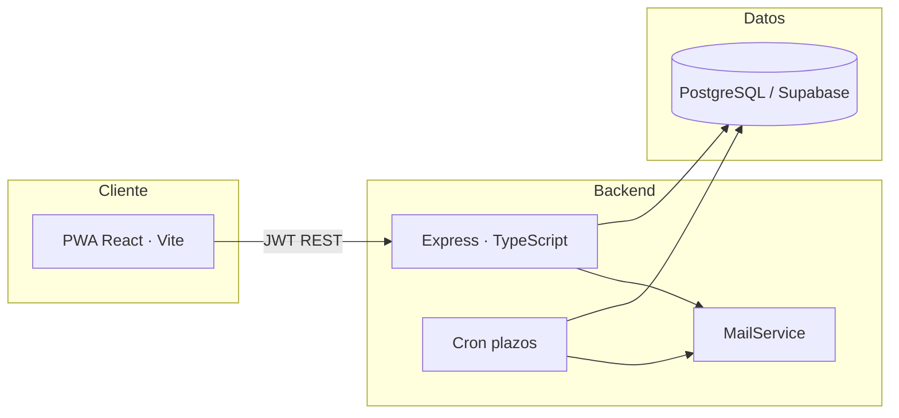

# TrekSafe

**Sistema automatizado de monitoreo y gestión de seguridad para turismo de aventura en alta montaña.**

TrekSafe desplaza el modelo reactivo tradicional de rescate hacia un **protocolo de verificación positiva**: el senderista registra su plan de expedición y confirma su retorno seguro; si no lo hace dentro del plazo acordado, el sistema escala alertas automáticas hacia contactos de emergencia y cuerpos de rescate, entregando de inmediato ubicación georreferenciada y ficha médica.

> Proyecto académico — **Universidad de Lima** · Ingeniería de Software 1 · 2026  
> **Estado:** Release 01 y Release 02 completados · **25/25 historias de usuario** · **96 story points**

---

## Tabla de contenidos

- [Problema y propuesta de valor](#problema-y-propuesta-de-valor)
- [Funcionalidades](#funcionalidades)
- [Arquitectura](#arquitectura)
- [Stack tecnológico](#stack-tecnológico)
- [Estructura del repositorio](#estructura-del-repositorio)
- [Inicio rápido](#inicio-rápido)
- [Base de datos](#base-de-datos)
- [API REST](#api-rest)
- [Scripts](#scripts)
- [Seguridad y cumplimiento legal](#seguridad-y-cumplimiento-legal)
- [Documentación](#documentación)
- [Equipo](#equipo)

---

## Problema y propuesta de valor

En entornos de senderismo independiente, la siniestralidad y el retraso en operaciones de rescate son críticos: la falta de información exacta sobre el paradero de las víctimas y la dependencia de reportes manuales prolongan las búsquedas durante las **horas doradas** posteriores a un incidente.

TrekSafe responde con **monitoreo pasivo** — sin hardware IoT ni rastreo GPS continuo — basado en:

1. **Registro digital del plan de ruta** (origen, destino, hora estimada de retorno, acompañantes y contactos).
2. **Check-in de retorno seguro** con ventana de tolerancia y escalamiento automático.
3. **Coordinación de rescate** mediante consola operativa para equipos especializados.

---

## Funcionalidades

### Para senderistas

| Área | Capacidades |
|------|-------------|
| **Cuenta** | Registro con consentimiento Ley N° 29733, login JWT, perfil personal |
| **Expedición** | Creación de plan de ruta, contactos vinculados, expedición activa con countdown |
| **Seguridad** | Check-in manual de retorno, recordatorio a 30 min del vencimiento |
| **Datos críticos** | Ficha médica cifrada AES-256, contactos de emergencia frecuentes |
| **Offline** | Borradores y contactos en caché (PWA + Service Worker) para zonas sin señal |
| **Privacidad** | Derechos ARCO: eliminación o anonimización de datos personales |
| **UX** | Interfaz mobile-first, modo oscuro para condiciones adversas en montaña |

### Para rescatistas

| Área | Capacidades |
|------|-------------|
| **Acceso** | Registro con validación simulada de credenciales institucionales (AGMP/MINCETUR) |
| **Consola** | Dashboard en tiempo real, filtro por zona, semáforo verde/amarillo/rojo |
| **Alertas** | Detalle de emergencia con ubicación y ficha médica (con auditoría de acceso) |
| **Operaciones** | Confirmación de recepción, bitácora con estados (En búsqueda → Localizados → Cerrado) |

### Motor del sistema

- **Cron job** de control de plazos que detecta expediciones vencidas sin check-in.
- **Notificaciones por correo** a contactos del senderista y equipos de rescate (SMTP o Brevo API).
- **Idempotencia** en despacho de alertas para evitar duplicados.

---

## Arquitectura

Monorepo con separación estricta de capas: el frontend **nunca** expone claves de Supabase; toda la persistencia pasa por la API REST con `service_role`.



**Backend — Clean Architecture**

```
presentation/   → Rutas HTTP, controllers, middleware
application/    → Servicios, DTOs, casos de uso
domain/         → Entidades y contratos
infrastructure/ → Repositorios, email, cron, cifrado, JWT
```

**Frontend — PWA mobile-first**

```
pages/          → Flujos senderista y rescatista
components/     → Layouts, diálogos, recordatorios
services/       → Cliente HTTP tipado
lib/            → Offline, validación, sesión, tema
```

---

## Stack tecnológico

| Capa | Tecnologías |
|------|-------------|
| **Frontend** | React 18 · Vite 6 · TypeScript · Tailwind CSS 4 · React Router · PWA (vite-plugin-pwa) |
| **Backend** | Node.js · Express · TypeScript · Zod · bcrypt · JWT · Helmet · CORS |
| **Base de datos** | PostgreSQL (Supabase) · pg · RLS deny-by-default |
| **Email** | Nodemailer (SMTP) · Brevo API (alternativa) |
| **Seguridad** | AES-256-GCM (ficha médica) · rate limiting en auth · auditoría de acceso médico |

---

## Estructura del repositorio

```
treksake-app/
├── backend/                 # API REST + cron + email
│   ├── src/
│   │   ├── presentation/    # HTTP (routes, controllers, middleware)
│   │   ├── application/     # Servicios de negocio
│   │   ├── domain/          # Entidades
│   │   └── infrastructure/  # DB, jobs, email, security
│   └── scripts/             # Utilidades (cron manual, pruebas de mail)
├── frontend/                # PWA React (sin claves Supabase)
│   └── src/
│       ├── pages/           # Pantallas por rol
│       ├── components/      # UI reutilizable
│       └── services/        # Cliente API
├── docs/                    # Backlog, DoR, DoD, UML, mockups Figma
├── init_schema.sql          # Esquema base + datos mock de prueba
├── enable_rls.sql           # Políticas RLS
├── sprint2_migration.sql    # Cifrado médico
├── sprint7_migration.sql    # Derechos ARCO
├── post_mvp_migration.sql   # Extensiones post-MVP
└── .env.example             # Plantilla de variables de entorno
```

---

## Inicio rápido

### Requisitos previos

- **Node.js** ≥ 20
- **npm** ≥ 10
- Proyecto en [Supabase](https://supabase.com) con PostgreSQL habilitado
- (Opcional) Servidor SMTP o API key de [Brevo](https://www.brevo.com) para alertas por correo

### 1. Clonar e instalar dependencias

```bash
git clone <url-del-repositorio>
cd treksake-app
npm run install:all
```

### 2. Configurar variables de entorno

Copia `.env.example` y crea los archivos de entorno:

```bash
# Backend — credenciales sensibles (NUNCA en el cliente)
cp .env.example backend/.env

# Frontend — solo la URL del API
echo "VITE_API_URL=http://localhost:3000/api" > frontend/.env
```

Edita `backend/.env` con los valores de **Supabase Dashboard → Project Settings → API / Database**:

| Variable | Descripción |
|----------|-------------|
| `SUPABASE_URL` | URL del proyecto |
| `SUPABASE_SERVICE_ROLE_KEY` | Clave `service_role` (solo backend) |
| `DATABASE_URL` | Connection string del pooler (puerto 5432) |
| `JWT_SECRET` | Secreto largo (`openssl rand -base64 64`) |
| `MEDICAL_ENCRYPTION_KEY` | Clave AES-256 de 32 bytes para ficha médica |
| `SMTP_*` o `BREVO_API_KEY` | Canal de envío de alertas |
| `CRON_INTERVAL_MS` | Intervalo del motor de plazos (default: 60000) |
| `CORS_ORIGIN` | Origen del frontend (default: `http://localhost:5173`) |

> En desarrollo, `MAIL_DEV_FALLBACK=true` permite continuar si el correo falla (p. ej. IP no autorizada en Brevo); en producción usar `false`.

### 3. Inicializar la base de datos

Ejecuta los scripts en el **SQL Editor de Supabase** (en orden):

1. `init_schema.sql`
2. `enable_rls.sql`
3. `sprint2_migration.sql`
4. `sprint7_migration.sql`
5. `post_mvp_migration.sql` *(si aplica)*

El esquema incluye usuarios mock para pruebas locales (ver comentarios al final de `init_schema.sql`).

### 4. Ejecutar en desarrollo

En terminales separadas:

```bash
npm run dev:backend    # → http://localhost:3000/api/health
npm run dev:frontend   # → http://localhost:5173
```

Verifica el health check:

```bash
curl http://localhost:3000/api/health
```

Respuesta esperada: `{ "status": "ok", "service": "treksafe-api", "mail": { ... }, "cron": { ... } }`

### 5. Build de producción

```bash
npm run build:backend
npm run build:frontend   # Salida en frontend/dist (PWA lista para desplegar)
```

---

## Base de datos

Modelo relacional en PostgreSQL con tipos ENUM para roles, estados de expedición y bitácora de rescate.

**Entidades principales:** `users`, `hikers_profile`, `rescuers_profile`, `expeditions`, `emergency_contacts`, `medical_info`, `rescue_logs`, `institutional_rescuer_registry`.

**Estados de expedición:** `programmed` → `in_progress` → `completed` | `alert`

El índice parcial sobre expediciones `in_progress` con deadline vencido optimiza el cron job (HU-11).

---

## API REST

Prefijo base: `/api` · Autenticación: `Authorization: Bearer <JWT>`

### Salud

| Método | Ruta | Auth | Descripción |
|--------|------|:----:|-------------|
| `GET` | `/health` | — | Estado del servicio, mail y cron |

### Autenticación

| Método | Ruta | Descripción |
|--------|------|-------------|
| `POST` | `/auth/register-hiker` | Registro de senderista |
| `POST` | `/auth/register-rescuer` | Registro de rescatista |
| `POST` | `/auth/login` | Login (emite JWT por rol) |

### Usuario senderista (`/user`)

| Método | Ruta | Descripción |
|--------|------|-------------|
| `GET/PUT` | `/medical-info` | Ficha médica cifrada |
| `GET/POST/DELETE` | `/contacts` | Contactos de emergencia |
| `POST` | `/privacy/revoke` | Revocación ARCO |

### Expediciones senderista (`/expeditions`)

| Método | Ruta | Descripción |
|--------|------|-------------|
| `POST` | `/` | Crear plan de expedición |
| `GET` | `/active` | Expedición en curso |
| `GET` | `/history` | Historial finalizado |
| `POST` | `/:id/check-in` | Confirmar retorno seguro |

### Rescate (`/rescue`)

| Método | Ruta | Descripción |
|--------|------|-------------|
| `GET` | `/expeditions` | Expediciones monitoreadas |
| `GET` | `/alerts` | Alertas activas |
| `GET` | `/alerts/:expeditionId` | Detalle de emergencia |
| `POST` | `/alerts/:expeditionId/confirm` | Confirmar recepción |
| `PATCH` | `/alerts/:expeditionId/log` | Actualizar bitácora |

---

## Scripts

| Comando | Descripción |
|---------|-------------|
| `npm run install:all` | Instala dependencias de backend y frontend |
| `npm run dev:backend` | API en modo watch (tsx) |
| `npm run dev:frontend` | PWA con hot reload |
| `npm run build:backend` | Compila TypeScript → `backend/dist` |
| `npm run build:frontend` | Build de producción PWA |
| `npm test --prefix backend` | Tests unitarios (Node test runner) |
| `npm run test:mail --prefix backend` | Verifica configuración de correo |
| `npm run test:rescue-alert --prefix backend` | Simula alerta de rescate |

---

## Seguridad y cumplimiento legal

| Medida | Implementación |
|--------|----------------|
| **Ley N° 29733** (Perú) | Consentimiento explícito en registro; ficha médica cifrada en reposo |
| **Derechos ARCO** | Eliminación/anonimización vía `POST /user/privacy/revoke` |
| **Segregación de roles** | JWT con rol `senderista` \| `rescatista`; middleware por ruta |
| **RLS** | Políticas deny-by-default en Supabase; acceso vía `service_role` en backend |
| **Auditoría médica** | Registro de accesos a ficha médica por rescatistas |
| **Rate limiting** | 20 req/15 min en endpoints de autenticación |
| **Sin claves en cliente** | Frontend solo conoce `VITE_API_URL` |

### Fuera de alcance (por diseño)

- Rastreo GPS continuo vía hardware IoT
- Integración con APIs gubernamentales reales (validación simulada)
- SMS de pago como canal de alerta

---

## Documentación

| Documento | Contenido |
|-----------|-----------|
| [`docs/product_backlog.md`](docs/product_backlog.md) | 25 historias de usuario (HU-01 a HU-25) |
| [`docs/tasks_mvp.md`](docs/tasks_mvp.md) | Desglose de tareas por sprint |
| [`docs/definition_of_ready.md`](docs/definition_of_ready.md) | Criterios DoR (CONNEXTRA, INVEST, Gherkin) |
| [`docs/definition_of_done.md`](docs/definition_of_done.md) | Criterios DoD y validación de cierre |
| [`docs/uml/README.md`](docs/uml/README.md) | Diagramas UML (Draw.io) |
| [`docs/mockups/`](docs/mockups/) | Prototipos Figma exportados |

---

## Equipo

| Integrante | Rol |
|------------|-----|
| **Marko Antonio Lopez Bernuy** | Product Owner |
| **Ariana Belen Blanco Quintana** | Scrum Master |
| **Manuel Rodrigo Llaury Murga** | Developer |
| **Pedro Leonardo Ormeño Moquillaza** | Developer |
| **Yahel Jair Cordova Amez** | Developer |

**Docente:** Jorge Luis Irey Nuñez  
**Universidad de Lima** · Facultad de Ingeniería · Carrera de Ingeniería de Sistemas

---

<p align="center">
  <sub>TrekSafe — Verificación positiva para senderistas en los Andes peruanos.</sub>
</p>
