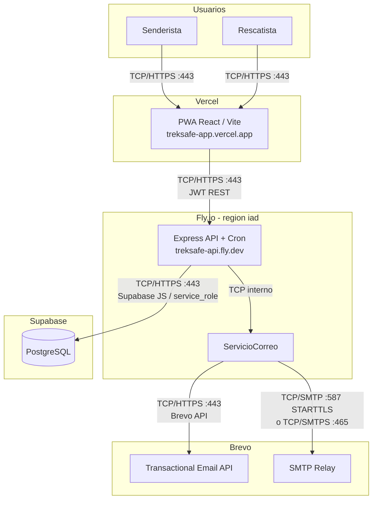

# TrekSafe

Monitoreo pasivo y verificación positiva para senderistas en alta montaña.

El senderista registra su plan de expedición y confirma el retorno seguro. Si no lo hace a tiempo, TrekSafe escala alertas automáticas a contactos de emergencia y equipos de rescate, con ubicación y ficha médica.

[Demo](https://treksafe-app.vercel.app) · [API /salud](https://treksafe-api.fly.dev/api/salud) · [`.env.example`](.env.example)


> Proyecto académico — **Universidad de Lima** · Ingeniería de Software 1 · 2026  
> Release 01–02 · **25/25** historias de usuario · **96** story points

## Contenido

- [Características](#características)
- [Arquitectura](#arquitectura)
- [Stack](#stack)
- [Estructura](#estructura)
- [Inicio rápido](#inicio-rápido)
- [Despliegue](#despliegue)
- [API](#api)
- [Seguridad](#seguridad)
- [Equipo](#equipo)
- [Licencia](#licencia)

## Características

**Senderista**
- Plan de ruta, countdown y check-in de retorno seguro
- Ficha médica cifrada AES-256 y contactos de emergencia
- PWA offline (borradores / caché) y derechos ARCO (Ley N° 29733)

**Rescatista**
- Consola con semáforo por zona y detalle de alerta (mapa + ficha médica auditada)
- Confirmación de recepción, bitácora e historial operativo

**Motor**
- Cron de plazos, alertas por correo (Brevo API o SMTP) e idempotencia de despacho

<details>
<summary>Detalle de capacidades</summary>

| Rol | Capacidades |
| --- | --- |
| Senderista | Registro/login JWT, expedición activa, recordatorio a 30 min, modo oscuro mobile-first |
| Rescatista | Validación institucional simulada (AGMP/MINCETUR), filtro por zona, estados En búsqueda → Localizados → Cerrado |
| Sistema | Sin IoT ni GPS continuo; monitoreo pasivo por verificación positiva |

</details>

## Arquitectura

Monorepo: el frontend **nunca** expone claves de Supabase; toda la persistencia pasa por la API con `service_role`.



**Backend (Clean Architecture):** `presentation` → `application` → `domain` ← `infrastructure`  
**Frontend:** pages / components / services / lib / context

## Stack

| Capa | Tecnologías |
| --- | --- |
| Frontend | React 18 · Vite 6 · TypeScript · Tailwind 4 · React Router · PWA |
| Backend | Node.js 22 · Express · Zod · bcrypt · JWT · Helmet · CORS |
| Datos | PostgreSQL (Supabase) · RLS deny-by-default |
| Email | Brevo API · Nodemailer (SMTP) |
| Seguridad | AES-256-GCM · rate limiting · auditoría de acceso médico |

## Estructura

```
treksake-app/
├── backend/          # API REST + cron + email (Fly.io)
├── frontend/         # PWA React (Vercel)
├── init_schema.sql   # Esquema + semillas
├── enable_rls.sql    # Reaplicar RLS (opcional)
└── .env.example      # Plantilla de entorno
```

## Inicio rápido

**Requisitos:** Node.js ≥ 20 · npm ≥ 10 · proyecto [Supabase](https://supabase.com) · (opcional) [Brevo](https://www.brevo.com)

```bash
git clone <url-del-repositorio>
cd treksake-app
npm run install:all

cp .env.example backend/.env
echo "VITE_API_URL=http://localhost:3000/api" > frontend/.env
# Completa SUPABASE_*, JWT_SECRET, MEDICAL_ENCRYPTION_KEY y correo en backend/.env
```

En el SQL Editor de Supabase ejecuta `init_schema.sql` (incluye semillas de prueba).

```bash
npm run dev:backend    # http://localhost:3000/api/salud
npm run dev:frontend   # http://localhost:5173
```

<details>
<summary>Variables de entorno principales</summary>

| Variable | Descripción |
| --- | --- |
| `SUPABASE_URL` / `SUPABASE_SERVICE_ROLE_KEY` | Solo backend |
| `JWT_SECRET` | ≥ 32 caracteres |
| `MEDICAL_ENCRYPTION_KEY` | 32 bytes AES-256 |
| `BREVO_API_KEY` o `SMTP_*` | Alertas por correo |
| `CORS_ORIGIN` | Origen del frontend |
| `MAIL_DEV_FALLBACK` | `true` en dev · `false` en prod |
| `VITE_API_URL` | URL del API (build-time en Vercel) |

Referencia completa: [`.env.example`](.env.example).

</details>

<details>
<summary>Scripts npm</summary>

| Comando | Descripción |
| --- | --- |
| `npm run install:all` | Dependencias backend + frontend |
| `npm run dev:backend` / `dev:frontend` | Desarrollo |
| `npm run build:backend` / `build:frontend` | Build producción |
| `npm test --prefix backend` | Tests |
| `npm run test:mail --prefix backend` | Verifica correo |
| `npm run test:rescue-alert --prefix backend` | Simula alerta |

</details>

## Despliegue

| Capa | Plataforma | URL |
| --- | --- | --- |
| PWA | Vercel | https://treksafe-app.vercel.app |
| API + cron | Fly.io (`iad`) | https://treksafe-api.fly.dev |
| DB | Supabase | `service_role` |
| Email | Brevo (desde Fly) | API y/o SMTP |

Orden: API → PWA (`VITE_API_URL`) → `CORS_ORIGIN` en Fly.

```bash
cd backend
fly apps create treksafe-api --org personal   # si no existe
powershell -File scripts/set-fly-secrets.ps1
fly deploy
```

Vercel: Root Directory `frontend` · Build `npm run build` · Output `dist` · Env `VITE_API_URL=https://treksafe-api.fly.dev/api`.

```bash
fly secrets set CORS_ORIGIN=https://treksafe-app.vercel.app -a treksafe-api
```

Artefactos: [`backend/fly.toml`](backend/fly.toml) · [`backend/Dockerfile`](backend/Dockerfile) · [`frontend/vercel.json`](frontend/vercel.json).

> Los correos salen desde **Fly**, no desde Vercel. Con API key de Brevo suele bastar; IP de egress fija: `fly ips allocate-egress -a treksafe-api -r iad`.

<details>
<summary>Base de datos</summary>

Estados de expedición: `programada` → `en_progreso` → `completada` | `alerta`.

Entidades: `usuarios`, `perfiles_senderista`, `perfiles_rescatista`, `expediciones`, `contactos_emergencia`, `fichas_medicas`, `bitacoras_rescate`, `despachos_correo`, `auditoria_acceso_medico`, …

Las migraciones `sprint*_migration.sql` y `post_mvp_migration.sql` están obsoletas (fusionadas en `init_schema.sql`).

</details>

## API

Prefijo `/api` · `Authorization: Bearer <JWT>` · JSON `camelCase`

| Área | Rutas clave |
| --- | --- |
| Salud | `GET /salud` |
| Auth | `POST /auth/registrar-senderista` · `registrar-rescatista` · `iniciar-sesion` |
| Usuario | `/usuario/ficha-medica` · `/contactos` · `/privacidad/revocar` |
| Expediciones | `POST /` · `GET /activa` · `GET /historial` · `POST /:id/confirmar-retorno` |
| Rescate | `/expediciones` · `/historial` · `/alertas` · confirmar · bitácora |

## Seguridad

| Medida | Implementación |
| --- | --- |
| Ley N° 29733 | Consentimiento en registro; ficha médica cifrada en reposo |
| Derechos ARCO | `POST /usuario/privacidad/revocar` |
| Roles JWT | `senderista` / `rescatista` |
| RLS | Deny-by-default; acceso vía `service_role` |
| Auditoría médica | Accesos de rescatistas registrados |
| Rate limiting | 20 req / 15 min en auth |
| Cliente | Solo `VITE_API_URL` (sin secretos) |

**Fuera de alcance:** GPS continuo IoT · APIs gubernamentales reales · SMS de pago.

## Equipo

| Integrante | Rol |
| --- | --- |
| Marko Antonio Lopez Bernuy | Product Owner |
| Ariana Belen Blanco Quintana | Scrum Master |
| Manuel Rodrigo Llaury Murga | Developer |
| Pedro Leonardo Ormeño Moquillaza | Developer |
| Yahel Jair Cordova Amez | Developer |

**Docente:** Jorge Luis Irey Nuñez · Universidad de Lima · Ingeniería de Sistemas

## Licencia

Proyecto académico (Universidad de Lima, 2026). Uso educativo del curso; sin licencia open source publicada en el repositorio.
